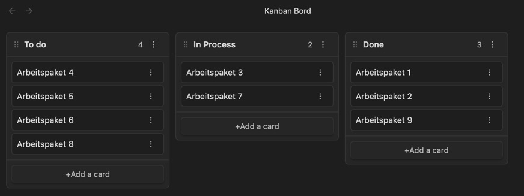

# Agiles Projektmanagement

## Handlungsziel

1. Erfasst und verwaltet die Anforderungen und Umsetzungsschritte nachvollziehbar für die Entwicklung im Team
    1. Kennt den Nutzen bezüglich kontinuierlicher toolunterstützter Entwicklung und Wartung (z.B. MVP, Kundenfeedback, Kosten/Nutzen, Qualität, Risiko- reduktion).
    2. Kennt Vorgehensweisen zur Verwaltung von Anforderungen (z.B. Stories, Issues, Akzeptanzkriterien etc.).
    3. Kennt Vorgehensweisen zur nachvollziehbaren Entwicklung im Team (z.B. Verknüpfung Commit mit Story, Pullrequest/PeerReview).

## Projektdefinition

>Vorhaben, das im Wesentlichen durch die Einmaligkeit aber auch Konstante der Bedingungen in ihrer Gesamtheit gekennzeichnet ist, wie Z . B. Zielvorgabe, zeitliche, finanzielle, personelle und andere Begrenzungen; Abgrenzung gegenüber anderen Vorhaben; projektspezifische Organisation.
>
>-- DIN 69901

## Agiles Manifesto

>Wir erschließen bessere Wege, Software zu entwickeln,
>indem wir es selbst tun und anderen dabei helfen.
>Durch diese Tätigkeit haben wir diese Werte zu schätzen gelernt:
> 
>- **Individuen und Interaktionen** mehr als Prozesse und Werkzeuge
>- **Funktionierende Software** mehr als umfassende Dokumentation
>- **Zusammenarbeit mit dem Kunden** mehr als Vertragsverhandlung
>- **Reagieren auf Veränderung** mehr als das Befolgen eines Plans
>
>Das heißt, obwohl wir die Werte auf der rechten Seite wichtig finden,
>schätzen wir die Werte auf der linken Seite höher ein.
>
> -- https://agilemanifesto.org/iso/de/manifesto.html

## Das Vorgehensmodell *Kanban*

Im Agilen Projektmanagement haben sich die Vorgehensmodelle *SCRUM* und *Kanban* durchgesetzt.
Beiden Modelle verwenden eine Iterative Vorgehensweise. Anders als in klassischen Vorgehensmodelle wie dem Wasserfall-Model, werden in die Arbeitspakete fortwährend erstellt und angepasst.

Wo *SCRUM* einer klar definiertem Struktur mit vordefinierten Zeremonien folgt (Daily, Refinement, Review, Retrospektive) ist *Kanban* flexibler gehalten. 

*Kanban* definiert, dass die Arbeitspakete, welche in einer Iteration erledigt werden, in verschiedene Stati unterteilt werden. Standardmässig heissen die Stati:

- **To do**: Arbeitspakete welche bereits definiert wurden, jedoch noch nicht bearbeitet werden
- **In Process**: Arbeitspakete welche momentan gerade bearbeitet werden
- **Done**: Arbeitspakete welche erfolgreich umgesetzt wurden

Da das Modul 324 nicht Projektmanagement im Fokus hat, werden wir für das Projekt *Kanban* verwenden. *Kanban* eignet sich auch für kleine privat-Projekte, oder zum Planen vom eigenen Tagesablauf.

**Einfaches Kanban Board**

### Arbeitspakete

Die Arbeitspakete, auch Stories/Cards/Tickets usw. genannt beinhalten die Tätigkeiten, welche erledigt werden müssen, um das Projekt erfolgreich umzusetzen.

- haben **Abhängigkeiten**
- müssen eine **klare "Definition of Done"** besitzen
- sollten **nur eine Aufgabe** beschreiben
    - die ein "und" im Titel haben, können meistens Aufgesplittet 

#### Verknüpfen mit Code (git, pull requests)

### Akzeptanzkriterien

## Kosten / Nutzen

## Kundenfeedback

## Tools

- [Github Projects](https://docs.github.com/en/issues/planning-and-tracking-with-projects)
- [Trello](https://trello.com/)
- [Jira](https://www.atlassian.com/software/jira)
- [Basecamp](https://basecamp.com/)
