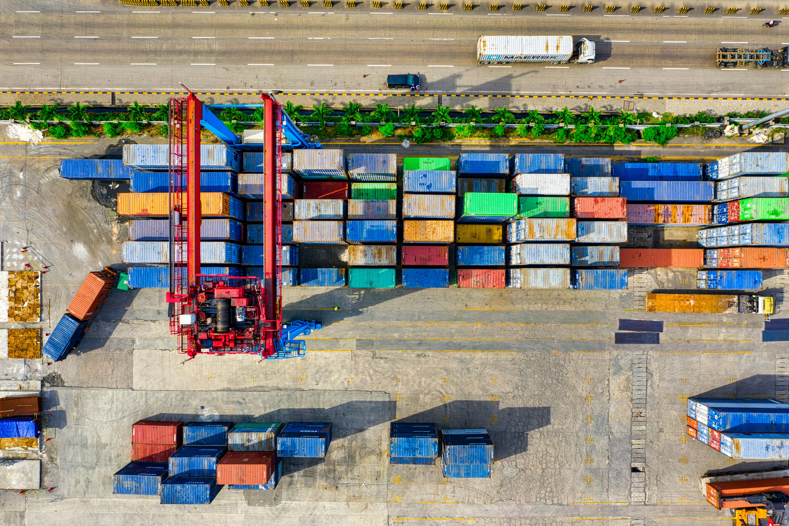

<!-- _class: big center -->

# Woche 6

## Docker / Dockerfile

### Modul 324

---

# Warentransport früher


- Verschiedene Dinge
- Verschiedene Grössen

- Schwierig zu Transportieren

---

# Warentransport heute

- Container standardisieren den Transport!
- Vierschiedene Dinge, verpackt in eine Einheitsgrösse 🤯 🚢 🚚

::: columns


:::split



:::

---

# Software ausliefern


::: columns

- Manuelle Arbeit beim Entwickeln
- Manuelle Arbeit beim Deployment

::: split

- Einmalige Arbeit beim Entwickeln (`Dockerfile`)

:::

---

# Docker Prinzip


---

# Dockerfile

::: columns l60 s2

- `FROM`: Erbt immer von einem Basis Image
- `ARG`: Environment Variablen während der build Zeit
- `ENV`: Environment Variablen während build und run Zeit
- `COPY`: Kopiert Dateien ins Image
- `SHELL`: Befehl, für die Standard-Shell.
  - Standard ist `sh` und nicht `bash`!
- `RUN`: Führt Befehle aus
- `EXPOSE`: Öffnet Ports auf die zugegriffen werden können
- `CMD`: Wird ausgeführt, wenn der Container gestartet wird

::: split

Beispieldatei für einen Nginx

```Dockerfile
FROM ubuntu:24.10 # Definiert die Basis

# Ausführen von Code (hier wie in einem Ubuntu)
# Installieren von Nginx
RUN apt-get -y update && apt-get -y install nginx git curl

# Kopieren von lokalen Dateien
# Die Nginx Konfigurationsdatei
COPY default /etc/nginx/sites-available/default
# Das HTML dass ausgeliefert werden soll
COPY src/* /usr/share/nginx/html

# Definieren, welche Ports geöffnet sind
EXPOSE 3000/tcp

# Befehl, der beim Ausführen ausgeführt werden soll
# Hier, starten vom Nginx
CMD ["/usr/sbin/nginx", "-g", "daemon off;"]
```

:::

::: footnotes

Referenz: https://docs.docker.com/reference/dockerfile/

:::

---

# Docker Image

- Sobald ein Dockerfile gebuildet wird, wird es zu einem Image
  - `docker build -f Dockerfile -t myimage:1.0.0`
- Es beinhaltet die Applikation sowie das Betriebssystem
- Es ist unveränderlich (immutable)
- Es kann in eine Registry hochgeladen werden
  - z.B. die Container Registry die wir auf AWS installiert haben
  - Oder auch auf hub.docker.com, die standard docker Registry
  - `docker push myimage:1.0.0`

::: footnotes

- https://docs.docker.com/reference/cli/docker/image/push/
- https://docs.docker.com/reference/cli/docker/buildx/build/

:::

---

# Docker Container

- Wird ein Docker Image ausgeführt, wird es zu einem Container

  - `docker run myimage:1.0.0`
  - `docker run --name myimage -d myimage:1.0.0`

- Ein Image kann mehrfach, gleichzeitig ausgeführt werden.
- `docker run` Befehle können sehr schnell, sehr kompliziert werden!

::: footnotes

https://docs.docker.com/reference/cli/docker/container/run/

:::

---

# Docker Compose

::: columns s2

- Eine Datei um Container zu Konfigurieren und das **Starten zu vereinfachen**.

  - `docker compose up` <br>startet alle definierten Container
  - `docker compose down` <br>beendet alle wieder

- **myservice** wird durch ein Dockerfile gebuildet
- **mysql** über ein Image von hub.docker.com

::: split

```yaml
services:
  myservice: # name des service
    # Definiert welches Dockerfile dem Service gehört
    build:
      context: . # Muss zum Ordner mit einem Dockerfile zeigen
      dockerfile: Dockerfile

    # Name des Containers
    container_name: myservice

    # Forwarden von einem Container Port nach localhost
    ports:
      - "3000:3000" # host-port:container-port

    # Synchronisiert Dateien local:container
    volumes:
      # alle Dateien werden im Container unter /app synchronisiert
      .:/app/
  mysql:
    container_name: mysql
    image: "mysql:latest" # Image von hub.docker.com
    environment: # Environment Variablen
      - "MYSQL_DATABASE=mydatabase"
      - "MYSQL_PASSWORD=secret"
      - "MYSQL_ROOT_PASSWORD=verysecret"
      - "MYSQL_USER=myuser"
    ports:
      - "3306:3306"
    volumes:
      - mysql-data:/var/lib/mysql # mounten vom persistenten volumen
      # - ./local:/local

volumes:
  # INFO: Ohne dieses Volumen löscht es die DB bei jedem Neustart
  #       Löschen: `docker volume rm projekt-m324-gruppe-ncooep_mysql-data`
  mysql-data:
```

:::

::: footnotes

https://docs.docker.com/compose/compose-application-model/

:::

---

# Dockerfile für die AWS Umgebung

- Muss den **TCP Port 3000** exposen

- Muss auf dem Port 3000 einen **Webserver** serven.

  - `Nginx` oder auch `node` oder `sprint-boot/tomcat`

- Muss auf dem Port 3000 eine Route **/up** besitzen die ein Status 200 OK
  zurückgibt.

  - Dies muss die App machen.
  - `curl http://localhost:3000/up` muss Status **200** zurückgeben
  - :zap: **Fehlt diese Route wird das Deployment fehlschlagen**

---

# Multistage Dockerfile für Angular

::: columns s2

Es existiert ein **eigenes build Image**, damit das **produktive Image kleiner**
ist (keine node_modules).

- Sourcecode ins Image kopieren `COPY`
- Abhängigkeiten installieren und builden `RUN` <br>
  `npm install && npm run build`
- App in neues Image Kopieren
- App Starten `CMD` <br> `node server/server.mjs`
- TCP Port 3000 als öffnen `EXPOSE`

:zap: **Diese Datei muss noch individuell angepasst werden!**

::: split

```Dockerfile
# Build Image definieren (siehe 'AS build')
FROM node AS build
## Ab hier wird im Folder /app gearbeitet
WORKDIR /app
## Kopieren der App-Dateien
COPY /appname .
## Installieren der Dependencies und Builden der App
RUN npm install && npm run build

# -------------

# Produktion Image definieren
FROM node
## die Standardshell nach bash ändern (kompatibler)
SHELL ["/bin/bash", "-c"]
## Ab hier wird im Folder /app gearbeitet
WORKDIR /app
## App vom Build Image kopieren (siehe `--from=build`)
COPY --from=build /app/dist/appname/ ./
## Starten des Servers wenn der Container gestartet wird
CMD ["node", "server/server.mjs"]
## Expose port 3000
EXPOSE 3000/tcp
```

:::

---

# Docker Cheat Sheet (nginx-tempate)

```bash
docker compose build # buildet alle Images
docker compose up -d # -d startet die services im hintergrund (keine logs)
docker compose down  # stop alle services
```

## Ohne devcontainer eine bash in einem container starten

```bash
docker ps                               # zeigt alle gestarteten container an
docker exec -it containername bin/bash  # startet bash im container
```

::: footnotes

https://docs.docker.com/get-started/docker_cheatsheet.pdf

:::
