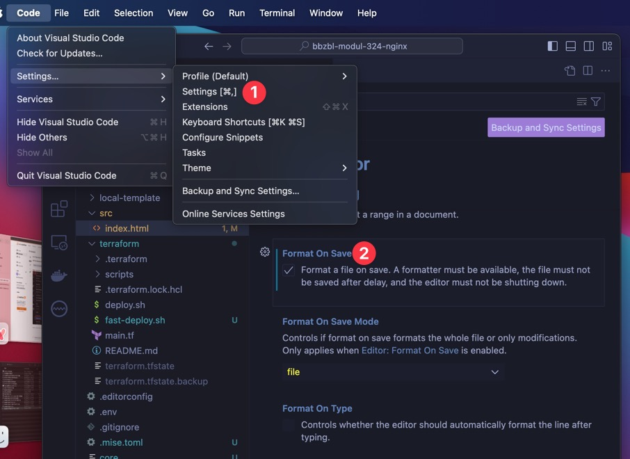

<!-- _class: big center -->

# Woche 5

## Formatierung und Linting

### Modul 324

---

# Was ist Formatierung?

Definition der **Darstellung des Codes** durch

- **Leerzeichen**

- **Einzüge**
- **Zeilenumbrüche**


---

# Ziele der Formatierung

::: columns

- Lesbarkeit

- Wartbarkeit
- Konsistenz

### Tastenkürzel

> - Windows: `Shift` + `Alt` + `F`
> - Mac: `Shift` + `Option` + `F`
> - Linux `Ctrl` + `Shift` + `I`

::: split

# <!--fit --> 💅

:::

---

# Formatierungs Regeln

- Es gibt in diesem Kurs keine vorgabe.

- Je nach Programmiersprache gibt es eigene standards.

> :bulb: Nehmt am besten den Standard der IDE!

## Gängige Plugins

- [Google Java Format](https://marketplace.visualstudio.com/items?itemName=wx-chevalier.google-java-format)
- [Prettier (JS/TS)](https://marketplace.visualstudio.com/items?itemName=esbenp.prettier-vscode)

---

# Format On Save

`Code -> Settings -> Format On Save`

Wenn `Format On Save` aktiviert ist, wird automatisch formatiert, sobald die
Datei gespeichert wird.



---

# .editorconfig

::: columns

- hilft **konsistente Coding-Styles** zu definieren

- funktioniert in unterschiedlichen Editoren
- Einfach lesbar

> :bulb: es existiert ein `.editorconfig`

::: split

```editorconfig
# .editorconfig

root = true

[*]
end_of_line = lf
insert_final_newline = true
charset = utf-8
indent_style = space
indent_size = 2
trim_trailing_whitespace = true
```

:::

::: footnotes

[https://editorconfig.org/](https://editorconfig.org/)

:::

---

# Prettier Action

::: columns

- Prettier ist der quasi Standard in der JavaScript Welt

- Es gibt eine Action die direkt den Code mit prettier formatiert **und
  commitet!**

- :zap: Prettier ist Formatierung und **nicht Linting**!

::: split

```yaml "./github/workflows/deploy.yml"
jobs:
  # ...
  prettier:
    permissions:
      contents: write
      pull-requests: write
    runs-on: ubuntu-latest
    steps:
      - name: Checkout
        uses: actions/checkout@v4
        with:
          ref: ${{ github.head_ref }}
          fetch-depth: 0
      - name: Prettify code
        uses: creyD/prettier_action@v4.3
        with:
          same_commit: true
          prettier_options: --write **/*.{js,md}
          only_changed: true
  test:
    # ...
  deploy:
    needs: [test, prettier]
    # ...
```

:::

---

<!-- _class: big -->

# :bulb: Merken

- ### Syntaktisch falscher Code kann nicht formatiert werden
- ### Formatierung zeigt Professionalität

---

# Was ist Linting?

Garantiert die **funktionale Korrektheit** durch das Identifizieren von

- **funktionelle Fehlern**
- **stilistischen Problemen**
- **unsicheren Praktiken**

## Gängige Plugins

- [ESLint](https://marketplace.visualstudio.com/items?itemName=dbaeumer.vscode-eslint)
- [SonarQube for IDE](https://marketplace.visualstudio.com/items?itemName=SonarSource.sonarlint-vscode)


---

# :dart: Ziele vom Linting

::: columns

- **Konformität und Standards**

- **einheitliche Qualität**
- **Sicherheit** -> _DevSecOps_

::: split

# <!-- fit --> 👮

:::

---

# ES Lint für Angular installieren

- `ng lint` -> alles mit "yes" akzeptieren

  - Es werden alle Dateien zur Konfiguration erstellt

- im `package.json` folgendes Script ergänzen

  `"lint:ci": "ng lint --output-file eslint_report.json --format json"`

  - Schreibt das Resultat in eine Datei `eslint_report.json`

- in der Github Action `./github/workflows/deploy.yml` vor dem testen linten

  - Beispiel folgt auf der nächsten Folie

---

# ES Lint für Angular in der Github Action

```yaml
# ...
test:
  name: Lint & Test
  runs-on: ubuntu-latest
  steps:
    # ...
    - name: Lint
      working-directory: neues-projekt
      run: npm run lint:ci # neues script!
    - name: Annotate Code
      uses: DerLev/eslint-annotations@v2 # Action für Anmerkungen am PR
      with:
        eslint-report: neues-projekt/eslint_report.json
      continue-on-error: true
    # ...
```

---

<!-- _class: big -->

# :bulb: Merken

- ### Syntaktisch falscher Code kann geprüft werden
- ### Gängige Strukturfehler werden erkannt (best practices)
- ### Linting erhöht massiv die Sicherheit!
