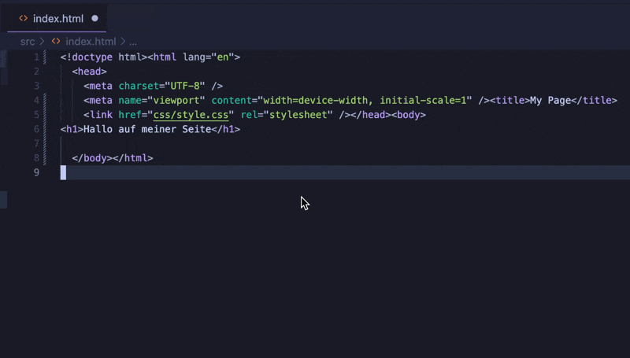
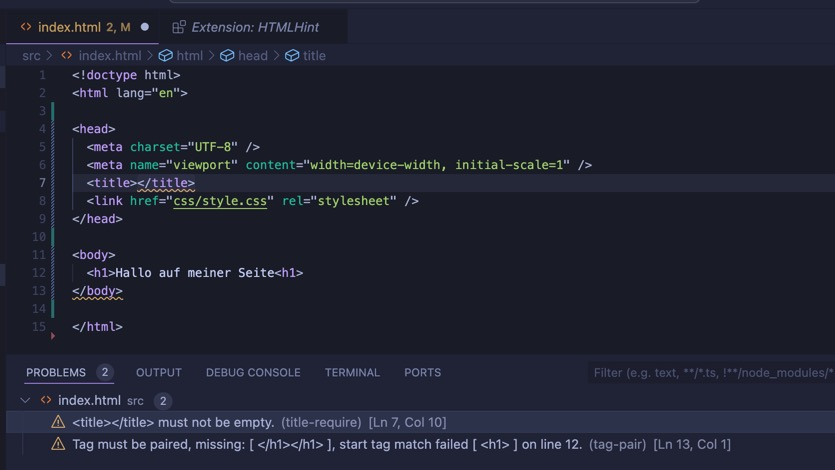

<!-- _class: big center -->

# Woche 3

## Formatierung und Linting

### Modul 324

---

# Was ist Formatierung?

Definition der **Darstellung des Codes** durch

- **Leerzeichen**

- **Einzüge**
- **Zeilenumbrüche**



---

# Ziele der Formatierung

::: columns

- Lesbarkeit

- Wartbarkeit
- Konsistenz

### Tastenkürzel

> - Windows: `Shift` + `Alt` + `F`
> - Mac: `Shift` + `Option` + `F`
> - Linux `Ctrl` + `Shift` + `I`

::: split

# <!--fit --> 💅

:::

---

# Formatierungs Regeln

- Es gibt in diesem Kurs keine vorgabe.

- Je nach Programmiersprache gibt es eigene standards.

> :bulb: Nehmt am besten den Standard der IDE!

## Gängige Plugins

- [Google Java Format](https://marketplace.visualstudio.com/items?itemName=wx-chevalier.google-java-format)
- [Prettier (JS/TS)](https://marketplace.visualstudio.com/items?itemName=esbenp.prettier-vscode)

---

# Format On Save

`Code -> Settings -> Format On Save`

Wenn `Format On Save` aktiviert ist, wird automatisch formatiert, sobald die
Datei gespeichert wird.


---

# .editorconfig

::: columns

- hilft **konsistente Coding-Styles** zu definieren

- funktioniert in unterschiedlichen Editoren
- Einfach lesbar

> :bulb: es existiert ein `.editorconfig`

::: split

```editorconfig
# .editorconfig

root = true

[*]
end_of_line = lf
insert_final_newline = true
charset = utf-8
indent_style = space
indent_size = 2
trim_trailing_whitespace = true
```

:::

::: footnotes

[https://editorconfig.org/](https://editorconfig.org/)

:::

---

<!-- _class: big -->

# :bulb: Merken

- ### Syntaktisch falscher Code kann nicht formatiert werden
- ### Formatierung zeigt Professionalität

---

# Was ist Linting?

Garantiert die **funktionale Korrektheit** durch das Identifizieren von

- **potenziellen Fehlern**

- **stilistischen Problemen**
- **unsicheren Praktiken**



---

# :dart: Ziele vom Linting

::: columns

- **Konformität und Standards**

- **einheitliche Qualität**
- **Sicherheit** -> _DevSecOps_

::: split

# <!-- fit --> 👮

:::

---

# SuperLinter

::: columns

[SuperLinter](https://github.com/marketplace/actions/super-linter) Eine
Kollektion von Linters, welche direkt in GitHub Actions verwendet werden können.

- Kann durch Environment Variablen gesteuert werden
- Es braucht einen Step, der die changes commited!

::: split

```yaml
steps:
- name: Super-Linter
  uses: super-linter/super-linter@v7.0.0
  env:
    GITHUB_TOKEN: ${{ secrets.GITHUB_TOKEN }}
    # Set your fix mode variables to true
    FIX_GOOGLE_JAVA_FORMAT: true
    VALIDATE_HTML_PRETTIER: true
- name: Commit and push linting fixes
  # Run only on:
  # - Pull requests
  # - Not on the default branch
  if: >
    github.event_name == 'pull_request' && github.ref_name !=
    github.event.repository.default_branch
  uses: stefanzweifel/git-auto-commit-action@v5
  with:
    branch: ${{ github.event.pull_request.head.ref }}
    commit_message: "chore: fix linting issues"
    commit_user_name: super-linter
    commit_user_email: super-linter@super-linter.dev
```

:::

---

<!-- _class: big -->

# :bulb: Merken

- ### Syntaktisch falscher Code kann geprüft werden
- ### Gängige Strukturfehler werden erkannt (best practices)
- ### Linting erhöht massiv die Sicherheit!
