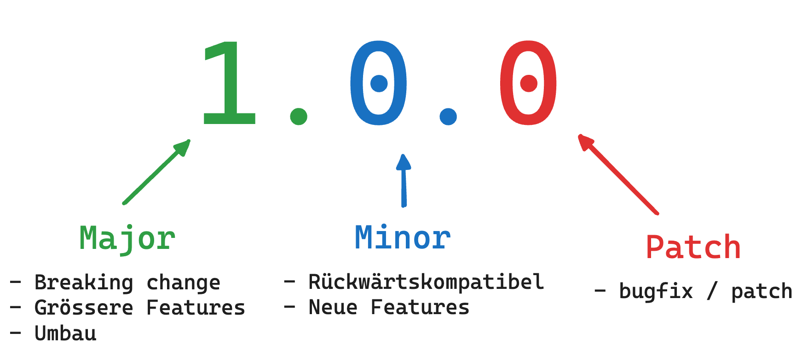

<!-- _class: big center -->

# Woche 5

## Git Best Practices

### Modul 324

---

# Git Flow (Basic)

::: columns

```mermaid
gitGraph
    commit
    branch develop
    checkout develop
    branch "feat/#1"
    checkout "feat/#1"
    commit
    commit
    checkout develop
    merge "feat/#1"
    branch "release/#1"
    commit tag: "v1.0.0"
    checkout main
    merge "release/#1"
    branch "fix/#1"
    checkout "fix/#1"
    commit
    checkout main
    merge "fix/#1"
    checkout develop
    merge "fix/#1"

```

::: split

1. Ein `develop` vom `main`

2. Ein `feat/#1` vom `develop`
3. Fetiges `feat/#1` nach `develop`
4. Ein `release/#1` vom `develop`
5. `release/#1` nach `develop` & `main`
6. Problem im main als `fix/#1`
7. `fix/#1` nach `develop` & `main`

:::

---

# Git Flow history

```bash
git branch develop
git branch feat/1
git commit -am "feat: mein tolles feature"
git checkout develop
git merge feat/1
git checkout release/1
git merge develop
git tag v1.0.0
git checkout main
git merge release/1
git branch hotfix/1
git commit -am "fix: oupsi"
git checkout main
git merge hotfix/1
git checkout develop
git checkout hotfix/1
```

---

<!-- _class: big center -->

# Git Flow ist aufwändig

### Macht erst bei richtig grossen Projekten Sinn

Viele komplexe Features gleichzeitig.

Cherry-Picken von commits für den Release

---

# GitHub Flow (empfohlen)

- ☝️ GitHub kennt ==nur **main**, **feature** und **hotfix** Branches==.
- 🏷️ **Tags** auf dem **`main`**-Branch sind **Releases**

::: columns

```mermaid
gitGraph
    commit
    branch "feat/#1"
    checkout "feat/#1"
    commit
    commit
    checkout "feat/#1"
    commit
    checkout main
    merge "feat/#1" tag: "v1.0.0"
    branch "fix/#1"
    commit
    checkout main
    merge "fix/#1" tag: "v1.0.1"
```

::: split

1. Ein `feat/#1` vom `main`

   - Feature umsetzen (`commits`)
   - Pull-Request / Diskussion

2. `feat/#1` nach `main` und löschen
3. Ein `fix/#1` von `main`

   - Fix umsetzen (`commits`)

4. `fix/#1` nach `main` und löschen

:::

---

# GitHub Flow history

```bash
git branch feat/#1
git commit -am "feat: mein tolles feature"
git checkout main
git merge feat/#1
git tag v1.0.0
git branch fix/#1
git commit -am "fix: oupsi"
git checkout main
git merge fix#1
```

---

<!-- _class: big -->

# Merke

### Git Flow und GitHub Flow haben gemeinsam dass

- für **jedes Feature** wird **ein Feature-Branch** erstellt wird

- für jeden Feature-Branch wird einen Pull-Request erstellt wird

---

<!-- _class: emoji-list -->

# Wichtiger `main` Branch!

- ⚡ Der `main`-Branch muss **immer eine funktionierende Version** des Produkts
  beinhalten.

- ⚡ Angefangene Features sollten im main Branch nicht dazu führen, dass die
  Applikation Fehlerhaft ist.
- :bulb: Es kann auf GitHub eingestellt werden, dass nicht direkt auf den main
  branch "gepushed" werden kann.

---

<!-- _class: big center -->

# Semantic Versioning



---

# Semantic Versioning

- Vereinfacht Management von Abhängigkeiten
- Kann Fehler durch upgrades verhindern
- Wichtig für Bibliotheken!

## Der letzte vom Baum?

- Für Projekte, die nicht von anderen verwendet werden, ist es nicht so
  relevant.
- Hier machen Tags wie :label: `sprintnummer-datum` mehr Sinn
- Trotzdem wichtig fürs Verständnis!

---

# Conventional Commits

```bash
<type>[optional scope]: <description>
```

## Typen

- **fix**: Behebt einen Fehler (version: **patch**)

- **feat**: Erstellt ein Feature (version: **minor**)
  - weitere sind **build**, **chore**, **ci**, **docs**, **style**,
    **refactor**, **perf**, **test**
- **[type]!**: Breaking change! (version: **major**)

::: footnotes

- https://www.conventionalcommits.org/en/v1.0.0/

:::

---

# Conventional Commits / _Beispiele_

- **feat:** allow provided config object to extend other configs (#12)

- **feat!**: send an email to the customer when a product is shipped (#13)
- **feat(api)!**: send an email to the customer when a product is shipped (#13)
- **chore!**: drop support for Node 6 (#11)
- **docs**: correct spelling of CHANGELOG
- **feat(lang)**: add language swiss-german (#7)
- **fix:** prevent racing of requests (#14)

::: footnotes

- https://www.conventionalcommits.org/en/v1.0.0/

:::

---

# Conventional Commits / _Vorteile_

- Einheitlichkeit -> Übersichtlichkeit!

- Führt zu kleineren, spezifischen Commits
- Automatisch generierte Changelogs: 😱
- Automatisches erkennen von Semantischer-Versionierung
