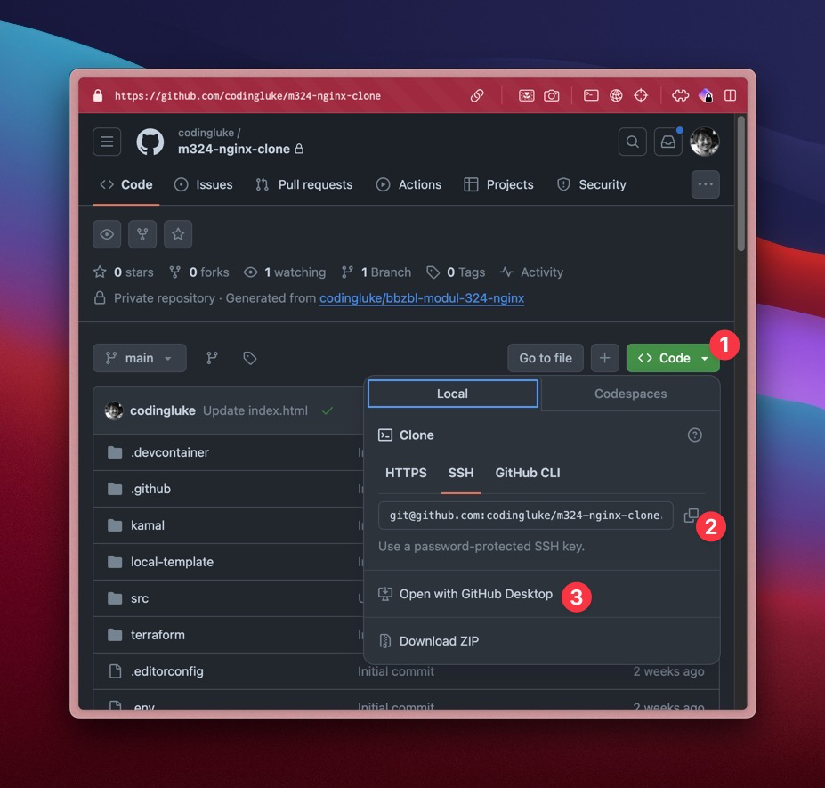
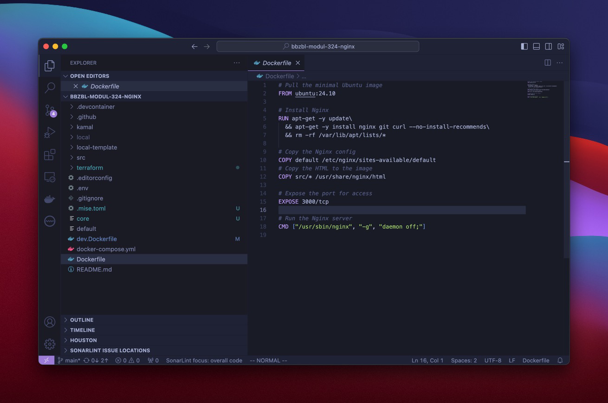
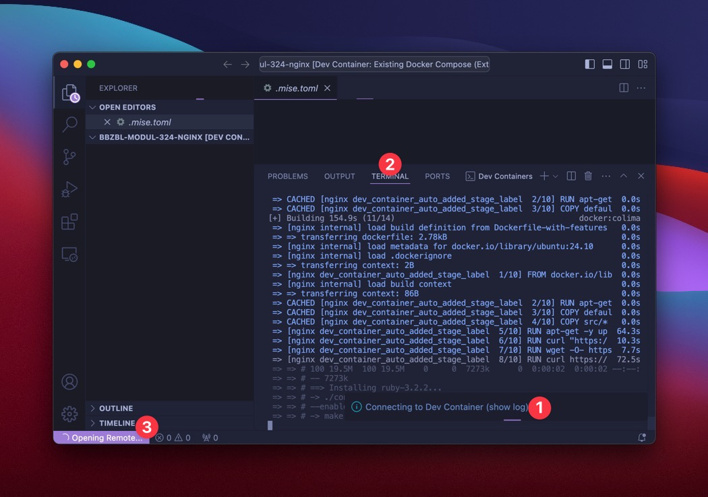

<!-- _class: big center -->

# Woche 3

## Lokales Entwickeln

### Modul 324

---

<!-- _class: big center -->

# Die Idee ist:

## alle haben die gleiche Entwicklungsumgebung, selbst auf Produktion!

## 🥳

---

# Verwendete Tools

- [Docker Desktop](https://www.docker.com/products/docker-desktop/)

- [Docker Compose](https://docs.docker.com/compose/install/)
- [VS Code](https://code.visualstudio.com/)
- [Git](https://github.com/git-guides/install-git#install-git) oder
  [Github Desktop](https://desktop.github.com/download/)


---

# Repository klonen

1. Unter Code Das grüne Dropdown `<> Code` öffnen

2. Die **SSH Url** kopieren
3. oder Sofern [GitHub Desktop](https://desktop.github.com/download/)
   installiert wurde **Open with GitHub Desktop** wählen.



---

# GitHub Desktop

[Github Desktop](https://desktop.github.com/download/) ist ein Grafisches Tool
um git repositories zu verwalten. In Github Desktop kann man mit einem GUI
Commiten.


---

# Öffnen in VS Code

1. `File -> Open folder`

2. Das frisch geklonte repository auswählen

3. Es sollte ungefähr wie rechts aussehen



---

# VS Code Plugins

### Core

- [Dev Containers](https://marketplace.visualstudio.com/items?itemName=ms-vscode-remote.remote-containers)
- [Docker](https://marketplace.visualstudio.com/items?itemName=ms-azuretools.vscode-docker)
- [Remote - SSH](https://marketplace.visualstudio.com/items?itemName=ms-vscode-remote.remote-ssh)
- [EditorConfig](https://marketplace.visualstudio.com/items?itemName=EditorConfig.EditorConfig)


---

# Öffnen in Devcontainer

VS Code fragt automatisch nach, ob das Projekt im Container geöffnet werden soll
sofern "Devcontainer" installiert wurde.

- **"Reopen in Container"** klicken und warten

- Nun wird der Container gebaut und gestartet. **Das kann einige Minuten
  dauern!**


---

# Devcontainer start

1. Wen auf "Connecting to Dev Container (Show Logs)" geklickt wird
2. erscheint folgender Log. Es zeigt wie das "Image" gebaut wird

3. Unten rechts ist ersichtlich ob VS Code in einem Container geöffnet
   wird/wurde.



---

# Devcontainer Terminal

1. Mit `+` kann ein neues Terminal geöffnet werden, _(z.B. zsh)_

2. Nun existiert ein ubuntu Terminal im Container. <br/> _(selbst unter
   Windows)_

3. Die Dateien sind "gemountet" unter `/workspace`


---

# Docker Compose

::: columns

Infos unter
[Docker Compose](https://docs.docker.com/compose/intro/features-uses/)

- Es verwendet das `.devcontainer/Dockerfile`
- Momentan wird `./src` zum Nginx gemountet
- `./local/.env` Environment Variablen werden auch im Container hinzugefügt
- Der Port 3000 wird exposed.

::: split

```yaml
# docker-compose.yml
services:
  nginx:
    build:
      context: .
      dockerfile: .devcontainer/Dockerfile
    container_name: devcontainer
    ports:
      - "3000:3000"
    env_file: ./local/.env
    volumes:
      # sync workspace
      - .:/workspace:cached
      ...
```

:::

---

# Installierte Tools im Container

Im Container sind folgendes Tool vorhanden

- **[`mise`](https://mise.jdx.dev/)**

Optional (Auskommentiert):

- AWS Cli um nach AWS zu connecten
- Terraform um in AWS die Infrastruktur hochzufahren
- Kamal um ein Dockerfile zu deployen


---

# Installiere Programmiersprachen mit `mise`

### Java

```bash
mise use java@lts -g
openjdk version "24-loom" 2025-03-18
OpenJDK Runtime Environment (build 24-loom+4-42)
OpenJDK 64-Bit Server VM (build 24-loom+4-42, mixed mode, sharing)
mise java@24.0.0-loom+4-42 ✓ installed
mise /workspaces/bbzbl-modul-324-nginx/.mise.toml tools: java@24.0.0-loom+4-42
```

### NodeJs

```bash
mise use node@lts -g
mise node@22.7.0 ✓ installed
mise /workspaces/bbzbl-modul-324-nginx/.mise.toml tools: node@22.7.0
```

---

# Installiere Programmiersprachen im `Dockerfile`

Wir ein Container neu gestartet, müssen die Programmiersprachen neu installiert
werden.

::: columns

- Durch das `.devcontainer/Dockerfile` können Sprachen beim erstellen vom Image
  installiert werden.
- So wird ermöglicht, dass alle Teammitglieder die gleiche Umgebung besitzen.

::: split

- Hier ein Beispiel für nodejs

```dockerfile
RUN mise use node@lts -g
```

:::
