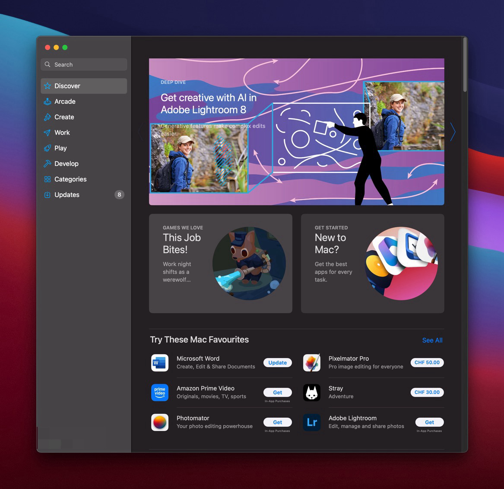

<!-- _class: big center -->

# Woche 5

## Paketmanagers

### Modul 324

---

# Programme

- Apple App Store
- Google Play Store
- Windows Store



---

# Hilfsprogramme

- Mac: brew, macPorts
- Windows: winget-cli, chocolatey
- Linux: apt-get, dnf, ...

---

# Programmiersprachen

::: columns

## Sprachabhängig

> Die Versionen werden global für alle Projekte gleich gesetzt.

- Node: nvm, ...
- Ruby: rvm, rbenv, ...
- Java: jvms, jenv,

::: split

## One to rule them all.

> Die Versionen werden global oder auch lokal, **pro Ordner/Projekt** definiert.

- [asdf](https://asdf-vm.com/)
- :star: [mise](https://mise.jdx.dev/) (basiert auf asdf) </br>

:::

---

# Programmiersprachen

- Besitzen **Standardbibliotheken**

- Besitzen **keine Spezifischen Bibliotheken**

- Bibliotheken **wurden früher "hart" kopiert**

- Das führte zu vielen Problemen 🙄

---

# Probleme beim Management von Abhängigkeiten

- Aufwand die Bibliotheken von Hand zu kopieren

- Welche Versionen werden genau verwendet?

  - Neue Versionen müssen von Hand gesucht, gefunden werden

  - Neue Versionen können Sicherheitslücken beinhalten!

- Gibt es zirkulare Abhängigkeiten? ♻️

  - d.H. Eine Abhängigkeit verwendet ebenfalls eine andere Abhängigkeit 🤯

- **und viele, viele mehr!**

---

# Packagemanagers

Alle Programmiersprachen besitzen heute Packagemanager!

- **Java**: [Maven](https://maven.apache.org/what-is-maven.html) /
  [Gradle](https://gradle.org/)

- **JavaScript/TypeScript**: [NPM](https://www.npmjs.com/) /
  [Yarn](https://yarnpkg.com/) / [Bun](https://bun.sh/) / ...
- **PHP**: [Composer](https://getcomposer.org/)
- **Ruby**: [Bundler](https://bundler.io/)
- **Python**: [PIP](https://pypi.org/project/pip/)

:zap: **Schaut euch die Doku zu dem an, den Ihr verwendet!**

---

# Was können Packagemanager?

- Definieren von Abhängigkeiten

  - `pom.xml`, `build.gradle`, `package.json`, ...

- Installieren von Abhängigkeiten

  - `mvn install`, `gradle install`, `npm install`, ...

- Updaten von Abhängigkeiten

  - `mvn versions:display-property-updates`, `gradle dependencyUpdates`,
    `npm update`

- :zap: **Es ist am besten die Dateien von Hand anzupassen!**

---

# Was können sie noch?

::: columns

## Taskdefinitionen

- Gängige Aufgaben können automatisiert werden

- Tests

- App Bauen

- Entwicklungsumgebung starten

- usw ...

::: split

## Security scanning

- Bekannte Versionsprobleme werden als Warning beim installieren ausgegeben!

:::

---

# Node: `package.json`

::: columns s2

**version**: Die Version der eigenen App

**scripts**: Eine liste von Scripts die via `npm run name` ausgeführt werden
können.

**dependencies**: Liste alle Pakete die verwendet werden. `npm install`
installiert diese im Ordner `node_modules`

**devDependencies**: Liste aller Pakete die nur während dem Entwickeln benötigt
werden.

### :zap: Nur die wichtigste Bereiche dargestellt

::: split

```json
{
  "version": "0.0.0",

  "scripts": {
    "start": "ng serve --port 3001",
    "build": "ng build",
    "test": "ng test"
  },

  "dependencies": {
    "@angular/animations": "^16.0.0",
    "@angular/common": "^16.0.0",
    ...
  },

  "devDependencies": {
    "@angular-devkit/build-angular": "^16.0.0",
    "@angular/cli": "~16.0.0",
    "@angular/compiler-cli": "^16.0.0",
    ...
  }
}
```

:::

::: footnotes

Referenz: https://docs.npmjs.com/cli/v10/configuring-npm/package-json

:::

---

# Java: `build.gradle` (gradle)

::: columns

**plugins**: Definition von gradle Plugins

**repositories**: Definition der Registry, standard ist
[mavenCentral](https://mvnrepository.com/)

**dependencies**: Liste der Abhängigen Pakete

**tasks**: Definition von Tasks

### :zap: Nur die wichtigste Bereiche dargestellt

::: split

```groovy
plugins {
  id 'org.springframework.boot' version '3.2.5'
  id 'io.spring.dependency-management' version '1.1.5'
}

repositories {
  mavenCentral()
}

dependencies {
  implementation 'org.springframework.boot:spring-boot-starter-web'
  testImplementation 'org.springframework.boot:spring-boot-starter-test'
  ...
}

tasks.named('test') {
    useJUnitPlatform()
}

```

:::

::: footnotes

https://docs.gradle.org/current/userguide/writing_build_scripts.html

:::

---

# Java: `pom.xml` (maven)

:::columns r60 s1

pom.xml und build.gradle können das gleiche. Gradle ist nur übersichtlicher

- Ich mag gradle um einiges mehr!

### :zap: Nur die wichtigste Bereiche dargestellt

::: split

```xml
<?xml version="1.0" encoding="UTF-8"?>
<project xmlns="http://maven.apache.org/POM/4.0.0" xmlns:xsi="http://www.w3.org/2001/XMLSchema-instance"
    xsi:schemaLocation="http://maven.apache.org/POM/4.0.0 http://maven.apache.org/xsd/maven-4.0.0.xsd">
    <modelVersion>4.0.0</modelVersion>

    <groupId>com.example</groupId>
    <artifactId>myproject</artifactId>
    <version>0.0.1-SNAPSHOT</version>

    <parent>
        <groupId>org.springframework.boot</groupId>
        <artifactId>spring-boot-starter-parent</artifactId>
        <version>1.1.4.RELEASE</version>
    </parent>

    <dependencies>
        <dependency>
            <groupId>org.springframework.boot</groupId>
            <artifactId>spring-boot-starter-web</artifactId>
        </dependency>
    </dependencies>

    <build>
      <plugins>
          <plugin>
              <groupId>org.springframework.boot</groupId>
              <artifactId>spring-boot-maven-plugin</artifactId>
          </plugin>
      </plugins>
    </build>

</project>
```

:::

:::footnotes

https://maven.apache.org/pom.html

:::
