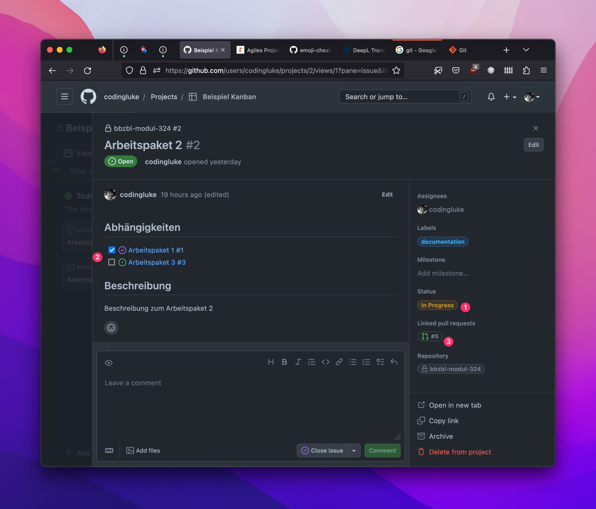

<!-- _class: big center -->

# Woche 2

## Projektmanagement / Sprint 1

### Modul 324

---

<!-- _class: big -->

> In software, we rarely have meaningful requirements. Even if we do, the only
> measure of success that matters is whether our solution solves the
> **customer's shifting idea of what their problem is**. --
> [Jeff Atwood](https://blog.codinghorror.com/), Gründer von
> [StackOverflow](https://stackoverflow.com/)

---

# Agile Vorgehensmethoden<sup>9</sup>

- Von grosser Beweglichkeit zeugend; regsam und wendig

## Inkrementell / Iterativ

- schrittweise erfolgend, aufeinander aufbauend
- sich schrittweise in wiederholten Rechengängen der exakten Lösung annähernd

::: footnotes

9. Duden | [agil](https://www.duden.de/rechtschreibung/agil),
   [iterativ](https://www.duden.de/rechtschreibung/iterativ),
   [inkrementell](https://www.duden.de/rechtschreibung/inkrementell)

:::

---


---

# Sprint

::: columns

## Start

- [**GitHub Issues**](https://codingluke.github.io/bbzbl-modul-324/docs/beurteilungen/LB3):
  Aufgaben beschreiben und ausarbeiten

## Ende

- [**Fachgespräch**](https://codingluke.github.io/bbzbl-modul-324/docs/beurteilungen/LB1):
  Sprint-Review

- [**Persönliche Reflexion**](https://codingluke.github.io/bbzbl-modul-324/docs/beurteilungen/LB2):
  Retrospektive auf den Sprint

::: split

## Pro Nachmittag

- **10' Stand-up**:<br> Planen, austauschen, Aufgaben verteilen

- [**Pull-Requests / Commits:**](https://codingluke.github.io/bbzbl-modul-324/docs/beurteilungen/LB3)<br>
  Aufgaben ausführen

:::

---

# Sprint 1 - Kickoff

- :dart: Gruppen kennenlernen
- :dart: Projekt finden
- :dart: GitHub kennenlernen
- :dart: Arbeitsgrundlage schaffen

---

# GitHub Issues _(Arbeitspakete)_

- haben **Abhängigkeiten** zu anderen Arbeitspakete.
- müssen eine **klare "Definition of Done"** besitzen.
- sollten nur **ein Feature** beschreiben.
- müssen nach fertigstellung an einen **Pull-Requests** geknüpft sein

> ## <!-- fit --> :bulb: Wenn ein "und" im Titel steht, kann es meistens Aufgesplittet werden.


---

# GitHub Issues _(Epics)_

- Beschrieben ein grösseres Feature
- **Zeigen auf Arbeitspakete** welche den Epic umsetzen.
- Dienen als **Gruppierung** von Arbeitspaketen
- **Löst selbst die Aufgabe nicht**, sondern Verlinkt nur zu Arbeitspakete
  (Issues)


---

# GitHub Projekt

- Tool um Arbeitspakete (GitHub Issues) zu strukturieren
- GitHub Issues brauchen kein Projekt, es macht es aber übersichtlicher


---

# GitHub Issue in Projekt

1. Status im Projekt
2. Link zu einem Pull-Request
3. Link zu anderen Issues

> ## <!-- fit --> :bulb: Der Text `#1` generiert einen <br> Link zum Issue mit Nummer `1`



---

<!-- _class: big center -->

# GitHub Projects und Issues

## [:link: zum Beispiel Projekt](https://github.com/users/codingluke/projects/2)

---

# Teambildung

- :dart: Jeder kennt sein Team

### :pencil: Auftrag

::: columns l60

Zusammen werden die Gruppen zusammengestellt:

- Eine Person die gerne koordiniert
- Eine Person die gerne überprüft
- Eine Person die leidenschaftlich gerne programmiert

::: split

- :dna: Gruppenarbeit
- :clock1: 10 Min
- :boom: **Nur zusammen ist man Stark!**

:::

---

# Rollen verteilen

- :dart: Jeder kennt seine Rolle im Team

### :pencil: Auftrag

::: columns l60

- **1 Teamleader**: Erstellt das GitHub repo und ladet andere ein, übernimmt
  Admin Aufgaben

- **1 Stakeholder**: Schaut sich die Arbeitspakete besonders gut an und prüft
  die Kriterien

- **1-2 Mitarbeiter**: Ist besonders fleissig am Programmieren

::: split

- :dna: Gruppenarbeit
- :clock1: 5 Min
- :boom: **Gute Rollenverteilung ist die halbe Miete!**

:::

---

# GitHub Repository erstellen

- :dart: Arbeitsgrundlage schaffen

### :pencil: Auftrag

::: columns l60

- Der Teamleader **erstellt** ein GitHub repository

  - Ihr dürft meine Vorlage nehmen
  - Der Namen ist änderbar (z.B `projekt-m324-gruppe-x`)

- Der Teamleader gibt allen Mitgliedern die Berechtigungen, inkl. der
  Lehrperson.

::: split

- :dna: Gruppenarbeit<br> _(einer macht, die anderen schauen zu)_
- :clock1: 10 Min
- :boom: **Ihr arbeitet alle im gleichen Repository!**

:::

---

# GitHub Projekt erstellen

- :dart: Arbeitsgrundlage schaffen
- :dart: GitHub kennenlernen

### :pencil: Auftrag

::: columns l60

- Im erstellten Repository ein
  [📜 GitHub Projekt](https://docs.github.com/en/issues/planning-and-tracking-with-projects/learning-about-projects/about-projects)
  erstellen.
- Erste [test-Issues](https://github.com/features/issues) erstellen und damit
  spielen
  - Verknüpfen, Taggen
  - Erstellt Tasks in Markdown <br>
    ```markdown
    - [ ] Task 1
    ```

::: split

- :dna: Gruppenarbeit<br> (oder auch Einzeln)
- :clock1: 20 Min
- :boom: **Schliesst die test-issues, nicht löschen! Sie dienen als Doku.**

:::

---

# Projekt finden

- :dart: Arbeitsgrundlage schaffen
- :dart: Kompromisse eingehen

### :pencil: Auftrag

::: columns l60

- Projekt als **GitHub Issue** beschreiben
- Es muss ein **Web-Projekt** sein
- Es **muss nicht fertig werden**!
- Es **darf ein bestehendes Projekt sein**

> :bulb: Statische HTML-Seite, ToDo App oder was grosses? Seit mutig und
> kreativ!

::: split

- :dna: Gruppenarbeit
- :clock1: 20 Min
- :boom: **Dieses Issue muss nicht nur eine Aufgabe besitzen**

:::

---

# Erste Epics und Issues definieren

- :dart: Projekt grob erfasst haben

### :pencil: Auftrag

::: columns l60

Hier ein Beispiel von Themen:

- Technologiewahl treffen
  - Die Programmiersprache ist **frei wählbar**
- Infrastruktur aufbauen
- Hello World mit gewählter Technologie
- Erste Features beschreiben
- Wireframe erstellen

::: split

- :dna: Gruppenarbeit
- :clock1: 45 Min
- :boom: **Für alle ein Ticket für die Reflektion zum Sprint 1 erstellen**

:::
